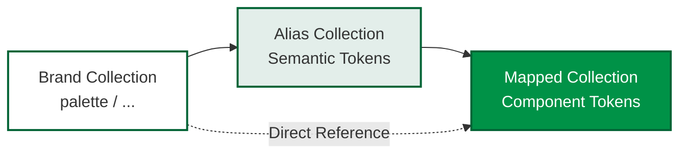

# Design Token Structure

## Overview

This document outlines the design token structure for the 2026 Sip Design System, extracted from the Figma file "2026 - SIP_DS_Foundations". The token architecture follows a three-tier system: **Brand** → **Alias** → **Mapped** collections.

## Variable Collection Architecture

The design system uses three variable collections that create a hierarchical relationship:



### Collection Hierarchy

1. **Brand Collection** (Foundation)
   - Contains primitive design values
   - Uses hierarchical path notation: `collection / category / name`
   - Example: `palette / background / paper: #FFFFFF`

2. **Alias Collection** (Semantic)
   - References brand tokens with semantic meaning
   - Bridges between brand and mapped tokens
   - Provides contextual meaning (e.g., "primary", "surface", "text")

3. **Mapped Collection** (Implementation)
   - Final tokens used in components
   - References alias or brand tokens directly
   - Example: `Elevation 24`, `Focused Field`

## Brand Collection

### Structure
Brand variables use a hierarchical path notation: `collection / category / variable-name`

### Extracted Variables

#### Typography
- **Font Family**
  - `font/family/Source Sans 3`: "Source Sans 3"
  - Primary font family for the design system

- **Font Sizes**
  - `font/size/Small`: 14px
  - Small font size for body text and small components

- **Font Weights**
  - `font/weight/regular`: regular (400)
  - `font/weight/bold`: bold (700)

- **Composite Typography Tokens**
  - `Desktop/Small/Regular`: Font family "Source Sans 3", size 14px, weight 400, line height 1.4
  - `Desktop/Small/Bold`: Font family "Source Sans 3", size 14px, weight 700, line height 1.4

#### Colors
- **Palette**
  - `palette / background / paper`: #FFFFFF
    - Base background color for surfaces and paper elements

- **Shades**
  - `Shades/white`: #FFFFFF
    - White color shade

#### Spacing
The brand collection includes a comprehensive spacing scale from 2px to 184px in increments. Common values include:
- `spacing/2`: 2px
- `spacing/4`: 4px
- `spacing/8`: 8px
- `spacing/12`: 12px
- `spacing/16`: 16px
- `spacing/20`: 20px
- `spacing/24`: 24px
- `spacing/28`: 28px
- `spacing/32`: 32px
- `spacing/36`: 36px
- `spacing/40`: 40px
- `spacing/44`: 44px
- `spacing/48`: 48px
- And continuing through 52, 56, 60, 64, 68, 72, 76, 80, 84, 88, 92, 96, 100, 104, 108, 112, 116, 120, 124, 128, 132, 136, 140, 144, 148, 152, 156, 160, 164, 168, 172, 176, 180, 184

### Pattern Analysis
The brand collection follows a hierarchical naming convention:
- `collection / category / variable-name` (e.g., `palette / background / paper`)
- `collection / variable-name` (e.g., `font / size / Small`, `Spacing / 12`)

*Note: Additional typography sizes (Medium, Large, XLarge, etc.) may exist in the Figma file but require selection of nodes that use those variables to extract.*

## Alias Collection

The alias collection serves as a semantic layer that:
- Maps brand tokens to meaningful names
- Provides context-specific token names
- Enables easier theme customization

### Structure
Alias variables typically reference brand tokens and provide semantic meaning.

*Note: To extract alias variables, select nodes in Figma that demonstrate alias token usage. Alias variables typically have names like "primary", "secondary", "surface", "text", etc.*

## Mapped Collection

### Structure
Mapped variables are the final implementation tokens used directly in components and styles.

### Extracted Variables

#### Spacing Tokens
All spacing values from the brand collection are available as mapped tokens with the format `Spacing/{value}`:
- `Spacing/2` through `Spacing/184`
- Each token references the corresponding brand spacing value
- Format in mapped collection: `Spacing/{value}` (e.g., `Spacing/12`)

#### Typography Tokens
Composite typography tokens that combine font family, size, weight, and other properties:
- `Desktop/Small/Regular`: Small size, regular weight
- `Desktop/Small/Bold`: Small size, bold weight

These composite tokens reference brand tokens:
- Font family: `font/family/Source Sans 3`
- Font size: `font/size/Small` (14px)
- Font weights: `font/weight/regular` or `font/weight/bold`

#### Grid Tokens
The grid system provides responsive layout tokens for 6 breakpoints:

| Breakpoint | Range | Container | Columns | Gutter | Margin |
|------------|-------|-----------|---------|--------|--------|
| Mobile | 320px - 479px | 320px | 4 | 16px | 16px |
| Tablet | 480px - 639px | 480px | 8 | 16px | 16px |
| Desktop | 640px - 1023px | 640px | 8 | 24px | 24px |
| Desktop-L | 1024px - 1365px | 1024px | 12 | 24px | 32px |
| Desktop-XL | 1366px - 1919px | 1366px | 12 | 24px | 48px |
| Desktop-XXL | 1920px+ | 1920px | 12 | 24px | 80px |

**Token Structure:**
- `grid.breakpoints.{breakpoint}.min` - Minimum viewport width
- `grid.breakpoints.{breakpoint}.max` - Maximum viewport width (null for Desktop-XXL)
- `grid.breakpoints.{breakpoint}.container` - Maximum container width
- `grid.breakpoints.{breakpoint}.columns` - Number of grid columns
- `grid.breakpoints.{breakpoint}.gutter` - Space between columns (CSS: `gap`)
- `grid.breakpoints.{breakpoint}.margin` - Container padding (Figma term: margin, CSS: `padding-left/right`)
- `grid.breakpoints.{breakpoint}.rows` - Row system for vertical rhythm (design reference)

**CSS Variables:**
- `--grid-breakpoint-{breakpoint}` - Breakpoint min-width values
- `--grid-columns-{breakpoint}` - Column counts
- `--grid-gutter-{breakpoint}` - Gutter spacing
- `--grid-margin-{breakpoint}` - Container padding
- `--container-{breakpoint}` - Container max-widths

**Utility Classes:**
- `.grid` - Responsive CSS Grid with automatic column/gutter updates per breakpoint
- `.container` - Responsive container with max-width and padding per breakpoint

#### Elevation Tokens
The system includes a comprehensive elevation scale (Elevation 1-24) with each level using three shadow layers:

| Token | Shadow Layer 1 | Shadow Layer 2 | Shadow Layer 3 |
|-------|---------------|---------------|---------------|
| Elevation 1 | `(0, 1) 3px rgba(0,0,0,0.06)` | `(0, 1) 1px rgba(2,99,53,0.07)` | `(0, 2) 1px rgba(0,0,0,0.15)` |
| Elevation 6 | `(0, 1) 18px rgba(0,0,0,0.06)` | `(0, 6) 10px rgba(2,99,53,0.07)` | `(0, 3) 5px rgba(0,0,0,0.15)` |
| Elevation 9 | `(0, 3) 16px rgba(0,0,0,0.06)` | `(0, 9) 12px rgba(2,99,53,0.07)` | `(0, 5) 6px rgba(0,0,0,0.15)` |
| Elevation 14 | `(0, 5) 26px rgba(0,0,0,0.06)` | `(0, 14) 21px rgba(2,99,53,0.07)` | `(0, 7) 9px rgba(0,0,0,0.15)` |
| Elevation 17 | `(0, 6) 32px rgba(0,0,0,0.06)` | `(0, 17) 26px rgba(2,99,53,0.07)` | `(0, 8) 11px rgba(0,0,0,0.15)` |
| Elevation 18 | `(0, 7) 34px rgba(0,0,0,0.06)` | `(0, 18) 28px rgba(2,99,53,0.07)` | `(0, 9) 11px rgba(0,0,0,0.15)` |
| Elevation 19 | `(0, 7) 36px rgba(0,0,0,0.06)` | `(0, 19) 29px rgba(2,99,53,0.07)` | `(0, 9) 12px rgba(0,0,0,0.15)` |
| Elevation 20 | `(0, 8) 38px rgba(0,0,0,0.06)` | `(0, 20) 31px rgba(2,99,53,0.07)` | `(0, 10) 13px rgba(0,0,0,0.15)` |
| Elevation 21 | `(0, 8) 40px rgba(0,0,0,0.06)` | `(0, 21) 33px rgba(2,99,53,0.07)` | `(0, 10) 13px rgba(0,0,0,0.15)` |
| Elevation 22 | `(0, 8) 42px rgba(0,0,0,0.06)` | `(0, 22) 35px rgba(2,99,53,0.07)` | `(0, 10) 14px rgba(0,0,0,0.15)` |
| Elevation 23 | `(0, 9) 44px rgba(0,0,0,0.06)` | `(0, 23) 36px rgba(2,99,53,0.07)` | `(0, 11) 14px rgba(0,0,0,0.15)` |
| Elevation 24 | `(0, 9) 46px rgba(0,0,0,0.06)` | `(0, 24) 38px rgba(2,99,53,0.07)` | `(0, 11) 15px rgba(0,0,0,0.15)` |

**Elevation Pattern:**
- Each elevation level uses three shadow layers
- Layer 1: Light black shadow with low opacity (0.06)
- Layer 2: Brand green shadow (rgba(2,99,53)) with varying opacity (0.07-0.12)
- Layer 3: Darker black shadow with higher opacity (0.15-0.26)
- Shadows increase in size and intensity as elevation level increases

#### Special Elevation Tokens
- **Focused Field**
  - Shadow Layer 1: `(0, 0) 2px rgba(0,146,71,1.0)` spread 4px
  - Shadow Layer 2: `(0, 0) 2px rgba(227,238,234,1.0)` spread 3px
  - Usage: Interactive focus states for form fields

#### Icon Tokens
The icon library includes 4 size variants (16px, 20px, 24px, 36px) with icons organized by category:

**Icon Sizes:**
- `icons.sizes.16`: 16px (small)
- `icons.sizes.20`: 20px (small-medium)
- `icons.sizes.24`: 24px (medium)
- `icons.sizes.36`: 36px (large)

**Icon Categories:**

1. **Social Media Icons** (`icons.social`)
   - instagram, tiktok, youtube, facebook, x (formerly Twitter), linkedin

2. **Navigation Icons** (`icons.navigation`)
   - home, search, mailOutlined, mailSolid, phone, map, list, menu

3. **Arrow Icons** (`icons.arrows`)
   - arrowLeftAlt, arrowRightAlt, arrowDownwardAlt, arrowUpwardAlt
   - keyboardArrowDown, keyboardArrowUp, keyboardArrowLeft, keyboardArrowRight
   - arrowDropUp, arrowDropDown

4. **UI Icons** (`icons.ui`)
   - expand, collapse, filters, favoriteOutlined, favoriteFilled, placeholder, view

5. **Form Icons** (`icons.forms`)
   - checkBoxOutlineBlank, checkBox, radioButtonChecked, radioButtonUnchecked

6. **Action Icons** (`icons.actions`)
   - cancel, delete, edit, add, export, dragHandle

7. **Data Icons** (`icons.data`)
   - money, percent, calendarMonth, calendarToday, language

**CSS Variables:**
- `--icon-size-16`: 16px
- `--icon-size-20`: 20px
- `--icon-size-24`: 24px
- `--icon-size-36`: 36px

**Usage:**
Icons are available in all 4 sizes (16px, 20px, 24px, 36px). Each icon token contains a `files` object with relative file paths for each size variant. The SVG files are located at `assets/icons/` within the project.

**File Structure:**
Each icon has 4 size variants following the naming pattern:
- `Icon - {size}px - {icon_name}.svg`

**Example Usage:**
```json
{
  "icons": {
    "social": {
      "instagram": {
        "files": {
          "16": "assets/icons/Icon - 16px - instagram.svg",
          "20": "assets/icons/Icon - 20px - instagram.svg",
          "24": "assets/icons/Icon - 24px - instagram.svg",
          "36": "assets/icons/Icon - 36px - instagram.svg"
        }
      }
    }
  }
}
```

**File Location:**
All icon SVG files are stored in `assets/icons/` using relative paths from the project root, making the project portable and version-control friendly.

### Connections to Brand Collection

#### Spacing Connections
All spacing tokens reference brand spacing values:
- `Spacing/{value}` → `brand.spacing.{value}`

#### Typography Connections
Typography composite tokens reference brand tokens:
- `Desktop/Small/Regular` → Uses `font/family/Source Sans 3`, `font/size/Small`, `font/weight/regular`
- `Desktop/Small/Bold` → Uses `font/family/Source Sans 3`, `font/size/Small`, `font/weight/bold`

#### Elevation Connections
All elevation tokens reference:
- **Background**: `palette / background / paper` (#FFFFFF)

This ensures consistent background color across all elevated surfaces.

## Styles

### Text Styles
*To extract text styles, select text elements in Figma that demonstrate typography usage.*

### Effect Styles
- **Elevation Styles (1-24)**: Corresponding to elevation tokens
- **Focused Field Style**: Special elevation for focused form fields

### Paint Styles
- **palette / background / paper**: Base background color

## Relationships and Connections

### Brand → Alias → Mapped Flow

```
Brand: palette / background / paper (#FFFFFF)
  ↓
Alias: [Semantic names like "surface", "base"]
  ↓
Mapped: Elevation tokens use brand directly
```

### Direct Brand → Mapped Connections

Some mapped tokens reference brand tokens directly:
- All elevation tokens use `palette / background / paper` as their background

## Usage Guidelines

### When to Use Each Collection

1. **Brand Collection**: Use when defining new primitive values or creating theme variations
2. **Alias Collection**: Use for semantic naming that makes sense across contexts
3. **Mapped Collection**: Use directly in components and implementation

### Elevation Usage

- **Elevation 1-6**: Subtle elevation for cards, buttons, and small components
- **Elevation 7-12**: Medium elevation for dropdowns, tooltips, and floating elements
- **Elevation 13-18**: High elevation for modals, dialogs, and overlays
- **Elevation 19-24**: Maximum elevation for top-level modals and critical overlays
- **Focused Field**: Exclusive use for form field focus states

## Token File Structure

The design tokens are organized in the following files:
- `tokens/brand.json` - Brand collection variables
- `tokens/alias.json` - Alias collection variables (when available)
- `tokens/mapped.json` - Mapped collection variables
- `tokens/styles.json` - Style definitions
- `tokens/design-tokens.css` - CSS custom properties

## Next Steps

To complete the extraction:
1. Select nodes in Figma that use brand variables across all categories (colors, typography, spacing, etc.)
2. Select nodes that demonstrate alias variable usage
3. Extract complete elevation scale (Elevation 2-5, 7-8, 10-13, 15-16)
4. Extract text styles and their variable mappings
5. Document any additional paint styles beyond background colors

## References

- Figma File: [2026 - SIP_DS_Foundations](https://www.figma.com/design/5abNQShIsPh4oFUoOHSQte/2026---SIP_DS_Foundations)
- Extraction Date: 2026-01-07
